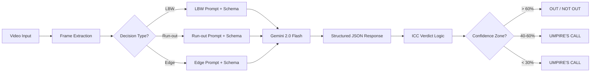

<div align="center">

# 🏏 BallOut Pro

### AI-Powered Cricket DRS System

[](LICENSE)
[](https://react.dev)
[](https://typescriptlang.org)
[](https://vite.dev)
[](https://ai.google.dev)
[](https://firebase.google.com)
[](CONTRIBUTING.md)

**BallOut Pro** brings professional-grade DRS (Decision Review System) to local and amateur cricket matches using AI-powered video analysis. Upload match footage or use a live camera — the AI umpire analyzes deliveries and returns verdicts with ICC-accurate decision logic.

[🚀 Live Demo](https://balloutpro.vercel.app) · [🐛 Report Bug](https://github.com/abhigyan6/Balloutpro-/issues) · [💡 Request Feature](https://github.com/abhigyan6/Balloutpro-/issues)

</div>

---

## ⚡ What It Does

BallOut Pro analyzes cricket video frames using **Google Gemini 2.0 Flash** and returns structured DRS decisions across three dismissal types:

| Decision Type | What It Tracks | AI Analyzes |
|:---:|:---:|:---|
| **LBW** | Pitching · Impact · Wickets | Ball trajectory, pad contact point, projected path to stumps |
| **Run-out** | Crease · Stumps · Margin | Batsman position, crease line, bail dislodgment timing |
| **Edge Detection** | UltraEdge · Hotspot · Bat | Bat-ball contact, deflection evidence, spike analysis |

### 🎯 ICC-Accurate Verdict Logic

Verdicts follow real DRS rules:

- 🟥 **OUT** — Clear evidence of dismissal, confidence > 60%
- 🟩 **NOT OUT** — Clear evidence against dismissal (e.g., pitching outside leg for LBW)
- 🟨 **UMPIRE'S CALL** — Borderline decisions: ball "Clipping" stumps, margin < 5cm for run-outs, or confidence in the 40–60% zone

---

## ✨ Features

- 🤖 **AI-Powered Analysis** — Google Gemini 2.0 Flash with decision-type-specific prompts and structured JSON responses
- 🎥 **Video Upload & Live Camera** — Analyze recorded footage or stream live from any camera
- 📊 **Real-Time Decision Panel** — Shows live tracking data (pitching/impact/wickets for LBW, crease/stumps/margin for run-outs, etc.)
- 🧠 **AI Reasoning** — Every decision includes a human-readable explanation of the AI's reasoning
- 📱 **Fully Responsive** — Works on desktop, tablet, and mobile
- 🎆 **Confetti & Animations** — Verdict-specific effects with Framer Motion
- 📤 **Export Decision Cards** — Download shareable PNG reports with match details and tracking data
- 🔥 **Firebase Integration** — Decision history persisted in Firestore with security rules
- 🎮 **Demo Mode** — Works without API keys using realistic mock scenarios for showcasing

---

## 🛠️ Tech Stack

| Layer | Technology |
|:---|:---|
| **Frontend** | React 19 · TypeScript · Tailwind CSS v4 |
| **Build** | Vite 6 |
| **AI** | Google Gemini 2.0 Flash (`@google/genai`) |
| **Database** | Firebase Firestore |
| **Animation** | Framer Motion (`motion`) |
| **Icons** | Lucide React |
| **Effects** | canvas-confetti |

---

## 🚀 Getting Started

### Prerequisites

- [Node.js](https://nodejs.org/) v18+
- [npm](https://www.npmjs.com/) or [yarn](https://yarnpkg.com/)
- (Optional) A [Gemini API Key](https://aistudio.google.com/apikey) for AI analysis
- (Optional) A [Firebase project](https://console.firebase.google.com/) for decision persistence

> **Note:** The app works without any API keys in **demo mode** — it generates realistic mock DRS decisions for testing and showcasing.

### Installation

```bash
# Clone the repo
git clone https://github.com/abhigyan6/Balloutpro-.git
cd Balloutpro-

# Install dependencies
npm install

# Copy environment template
cp .env.example .env

# Start development server
npm run dev
```

The app will be live at **http://localhost:3000**

### Environment Variables

Create a `.env` file in the project root (see `.env.example`):

```env
# AI Analysis (optional — demo mode works without this)
VITE_GEMINI_API_KEY=your_gemini_api_key_here

# Firebase (optional — history won't persist without this)
VITE_FIREBASE_API_KEY=your_firebase_api_key
VITE_FIREBASE_AUTH_DOMAIN=your_project.firebaseapp.com
VITE_FIREBASE_PROJECT_ID=your_project_id
VITE_FIREBASE_STORAGE_BUCKET=your_project.firebasestorage.app
VITE_FIREBASE_MESSAGING_SENDER_ID=your_sender_id
VITE_FIREBASE_APP_ID=your_app_id
VITE_FIREBASE_MEASUREMENT_ID=your_measurement_id
```

---

## 📁 Project Structure

```
Balloutpro-/
├── src/
│   ├── App.tsx                 # Main application (home + analyzer views)
│   ├── main.tsx                # React entry point
│   ├── types.ts                # TypeScript enums & interfaces
│   ├── index.css               # Global styles, animations, Tailwind theme
│   ├── firebase-config.ts      # Firebase init & Firestore operations
│   ├── vite-env.d.ts           # Vite environment type declarations
│   └── services/
│       └── geminiService.ts    # AI decision engine (prompts, schemas, verdict logic)
├── index.html                  # Entry HTML
├── firestore.rules             # Production Firestore security rules
├── vite.config.ts              # Vite configuration
├── tsconfig.json               # TypeScript configuration
├── .env.example                # Environment variable template
├── LICENSE                     # MIT License
└── package.json
```

---

## 📜 Available Scripts

| Command | Description |
|:---|:---|
| `npm run dev` | Start dev server on port 3000 |
| `npm run build` | Production build to `dist/` |
| `npm run preview` | Preview production build locally |
| `npm run lint` | Type-check with `tsc --noEmit` |
| `npm run clean` | Remove `dist/` folder |

---

## 🏗️ How the AI Decision Engine Works



Each decision type gets its own:
1. **Prompt** — Cricket-expert-level instructions specific to LBW, Run-out, or Edge Detection
2. **Response Schema** — Structured JSON schema enforcing the correct fields (e.g., `pitching`, `impact`, `wickets` for LBW)
3. **Verdict Logic** — ICC-rules-based determination with proper Umpire's Call thresholds

---

## 🌐 Deployment

### Vercel (Recommended)

1. Push to GitHub
2. Import the repo on [vercel.com](https://vercel.com)
3. Vercel auto-detects Vite — no config needed
4. Add environment variables in **Project Settings → Environment Variables**
5. Deploy ✅

### Manual

```bash
npm run build
# Deploy the dist/ folder to any static host
```

---

## 🔐 Security

- **Firestore Rules** — Default deny; authenticated writes only with strict field validation
- **API Keys** — All keys are loaded via environment variables, never committed to git
- **`.env` is gitignored** — Secrets stay local

---

## 🤝 Contributing

Contributions are what make the open-source community amazing. Any contributions you make are **greatly appreciated**.

1. **Fork** the repository
2. **Create** your feature branch (`git checkout -b feature/amazing-feature`)
3. **Commit** your changes (`git commit -m 'feat: add amazing feature'`)
4. **Push** to the branch (`git push origin feature/amazing-feature`)
5. **Open** a Pull Request

### Ideas for Contributions

- 🎨 Add ball-tracking visualization overlay on the video
- 📹 Support for slow-motion replay
- 📊 Match statistics dashboard
- 🔊 Audio analysis for edge detection (actual snickometer)
- 🌍 Multi-language support
- 📱 PWA support for offline use
- 🧪 Unit and integration tests

---

## 📄 License

Distributed under the **MIT License**. See [`LICENSE`](LICENSE) for more information.

You are free to use, modify, and distribute this project. Attribution is appreciated but not required.

---

## 👥 Authors

Built with ❤️ for **GDG Bhopal**

| | Name | GitHub |
|:---:|:---|:---|
| 🏏 | **Abhigyan Dwivedi** | [@abhigyan6](https://github.com/abhigyan6) |
| 🏏 | **Veerendra** | |
| 🏏 | **Aman** | |

---

## 🙏 Acknowledgments

- [Google Gemini AI](https://ai.google.dev) — for the multimodal AI analysis capabilities
- [Firebase](https://firebase.google.com) — for real-time database and hosting
- [Vite](https://vite.dev) — for the blazing-fast build tooling
- [Tailwind CSS](https://tailwindcss.com) — for the utility-first styling
- [Lucide Icons](https://lucide.dev) — for the beautiful icon set
- [Framer Motion](https://motion.dev) — for the smooth animations
- The cricket community 🏏 — for inspiring us to build better tools for the game

---

<div align="center">

**If BallOut Pro helped you, consider giving it a ⭐**

[](https://github.com/abhigyan6/Balloutpro-)

</div>
